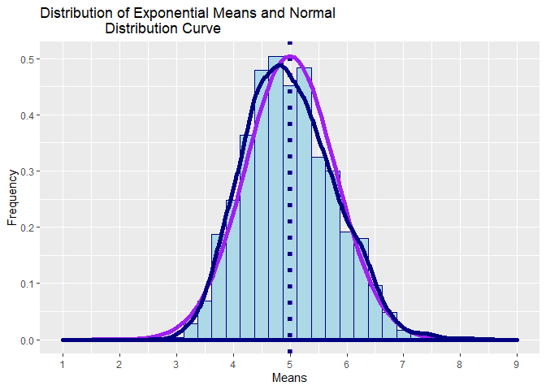

Statistical Inference Course Project: Part 1
================
Jordan Woloschuk
8/13/2019

## Overview:

In this project I will investigate the exponential distribution in R and
compare it with the Central Limit Theorem.

  - The exponential distribution can be simulated in R with rexp(n,
    lambda) where lambda is the rate parameter.

  - The mean of exponential distribution is 1/lambda and the standard
    deviation is also 1/lambda.

In this project, I will set lambda = 0.2 for all of the simulations.

I will investigate the distribution of averages of 40 exponentials, and
will conduct a thousand simulations.

## Simulations:

We will first set the seed of R‘s random number generator. This is done
to create simulations or random objects that can be reproduced.

``` r
# Setting R Seed to 1 (any number would work)

set.seed(1)
```

We will next set the constants that will be used in our simulations.

``` r
# Number of simulations
numsim <- 1000

# Lamda (lambda is the rate parameter)
lamda <- 0.2

# Number of exponentials
n <- 40
```

We will run the simulation and produce a matix with 40,000 observations
(n \* numsim).

``` r
# Run the exponential simulations and populate a numsim * n matrix
Expo_Matrix <- matrix(rexp(n*numsim,lamda),nrow = numsim,ncol = n)

# Calculate the means for each row (create data.frame for ggplot)
Expo_Matrix_Means <- data.frame(expo_means = apply(Expo_Matrix,1,mean))
```

The following plot displays the distributions of exponential means.

``` r
g_expo <- ggplot(Expo_Matrix_Means, aes(expo_means)) + 
        geom_histogram(color = "navy", fill = "lightblue", binwidth = 0.25) +
        ggtitle("Distribution of Exponential Means") + 
        xlab("Means")+ylab("Frequency")

g_expo
```

<!-- -->

## Sample Mean versus Theoretical Mean:

The theoretical mean (mu) of a exponential distribution of rate lambda
is equal to the 1/lamda.

``` r
# Calculation of mu
mu <- 1/lamda
```

In our example, mean (mu) is equal to 5

While, the sample mean (X\_bar) is the average of the 1,000
simululations of the 40 sampled exponentials.

``` r
# Calculation of X_bar
X_bar <- mean(Expo_Matrix_Means$expo_means)
```

From our simulations, we calculate that the sample mean (X\_bar) is
equal to 4.9900252

As expected, the sample mean (X\_bar) and the theoretical mean (mu) are
very similar, with an absolute difference of only 0.0099748.

## Sample Variance versus Theoretical Variance:

The theoretical varaince (Var) of a exponential distribution of rate
lambda is equal to sigma^2. While, simga (standard deviation) is equal
to 1/(sqrt(n)\*lamda)

``` r
# Calculation of the standard deviation
sigma <- 1/(lamda*sqrt(n))

# Calcualtion of the variance
Var <- sigma**2
```

In our example, the variance (Var) is equal to 0.625, and the standard
deviation is equal to 0.7905694.

While, the sample varaince (Var\_sample) is varaince of the the average
of the 1,000 simululations of the 40 sampled exponentials, with a
standard deviation equal to sigma\_sample.

``` r
# Calculation of the sample standard deviation
sigma_sample <- sd(Expo_Matrix_Means$expo_means)

# Calcualtion of the sample variance
Var_sample <- sigma_sample**2
```

From our simulations, we calculate the sample variance (Var\_sample) is
equal to 0.6177072, and the sample standard deviation is equal to
0.7859435.

As expected, the sample variance (Var\_sample) and the theoretical
variance (Var) are similar, with an absolute difference of only
0.0072928.

## Distribution:

We can get a sense if a distribution is is approximately normal by
comparing the population mean and standard deviation, with a normal
distribution of the expected values,

``` r
# Create new plot with two x-axis intercepts at the the sample mean (navy dotted)
# and theoretical mean (purple dotted). 

g_distribution <- ggplot(data = Expo_Matrix_Means, aes(x = expo_means)) + 
        geom_histogram(aes(y=..density..), color = "navy", fill = "lightblue",
                       binwidth = 0.25) +
        geom_vline(xintercept = mu, size=2, colour="purple",linetype="dotted") + 
        geom_vline(xintercept = X_bar, size=2, colour="navy",linetype="dotted") + 
        # Add the distribution curves for the normal distribution (purple) 
        # and for the simulation (navy)  theoretical mean (purple dotted) 
        stat_function(fun = dnorm, args = list(mean = mu, sd = sigma), 
                      colour = "purple", size=2) + 
        geom_density(colour="navy", size=2) +
        # Add scaling and labels
        scale_x_continuous(breaks=seq(mu-4,mu+4,1), limits=c(mu-4,mu+4)) + 
        ggtitle("Distribution of Exponential Means and Normal 
                Distribution Curve") + xlab("Means") + ylab("Frequency") 

g_distribution
```

<!-- -->

From the previous chart, the estimated distribution of means of 40
sampled exponantial distributions (navy line), overlaps fairly closely
with the the the normal distribution (purple line) with the expected
values based on the given lamba value of 0.2.
