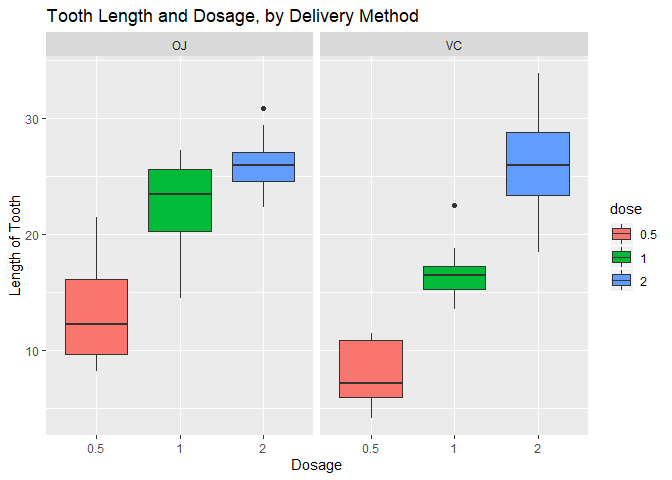
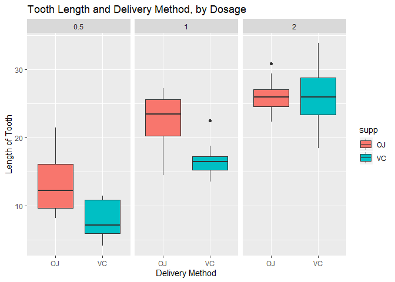

Statistical Inference Course Project: Part 2
================
Jordan Woloschuk
8/13/2019

## Overview:

In this project I will analyze the ToothGrowth data contianed withing
the R datasets package. This analysis will include four (4) main steps.

  - Load the ToothGrowth data and perform some basic exploratory data
    analyses
  - Provide a basic summary of the data.
  - Use confidence intervals and/or hypothesis tests to compare tooth
    growth by supp and dose.
  - State your conclusions and the assumptions needed for your
    conclusions.

## Load the ToothGrowth Data

In this section we will load the ToothGrowth data and perform some basic
exploratory data analyses.

``` r
# Load ToothGrowth
data("ToothGrowth")

# Set the dose as a factor instead of the default num class. This is done for
# future plots.
ToothGrowth$dose <- as.factor(ToothGrowth$dose)
```

## Summary of the ToothGrowth data

In this section we will provide a basic summary of the ToothGrowth data.

``` r
# Use summary to display a summary of the data
summary(ToothGrowth)
```

    ##       len        supp     dose   
    ##  Min.   : 4.20   OJ:30   0.5:20  
    ##  1st Qu.:13.07   VC:30   1  :20  
    ##  Median :19.25           2  :20  
    ##  Mean   :18.81                   
    ##  3rd Qu.:25.27                   
    ##  Max.   :33.90

``` r
# Use str to display the structure of the data
str(ToothGrowth)
```

    ## 'data.frame':    60 obs. of  3 variables:
    ##  $ len : num  4.2 11.5 7.3 5.8 6.4 10 11.2 11.2 5.2 7 ...
    ##  $ supp: Factor w/ 2 levels "OJ","VC": 2 2 2 2 2 2 2 2 2 2 ...
    ##  $ dose: Factor w/ 3 levels "0.5","1","2": 1 1 1 1 1 1 1 1 1 1 ...

``` r
# Use head and tail to show the first six (6) and last six(6) rows of data.
head(ToothGrowth)
```

    ##    len supp dose
    ## 1  4.2   VC  0.5
    ## 2 11.5   VC  0.5
    ## 3  7.3   VC  0.5
    ## 4  5.8   VC  0.5
    ## 5  6.4   VC  0.5
    ## 6 10.0   VC  0.5

``` r
tail(ToothGrowth)
```

    ##     len supp dose
    ## 55 24.8   OJ    2
    ## 56 30.9   OJ    2
    ## 57 26.4   OJ    2
    ## 58 27.3   OJ    2
    ## 59 29.4   OJ    2
    ## 60 23.0   OJ    2

The following chart displays the total tooth length compared to the dose
amount, split by the method of delivery

``` r
# Plot of tooth lenth vs dosage, by delivery method
g_len_dose <- ggplot(ToothGrowth, aes(dose,len))+geom_boxplot(aes(fill = dose))+
        facet_grid(~supp) + ylab("Length of Tooth") + xlab("Dosage") +
        ggtitle("Tooth Length and Dosage, by Delivery Method")

g_len_dose
```

<!-- -->

The following chart displays the total tooth length compared to the
delivery method, split by the dosage.

``` r
# Plot of tooth lenth vs supp, by dosage
g_len_supp <- ggplot(ToothGrowth, aes(supp,len))+geom_boxplot(aes(fill = supp))+
        facet_grid(~dose) + ylab("Length of Tooth") + xlab("Delivery Method") +
        ggtitle("Tooth Length and Delivery Method, by Dosage")

g_len_supp
```

<!-- -->

## Comparison of Tooth Growth by Supplement Delivery Type

I will use a T-test to compare the tooth growth length compared to the
delivery method.

``` r
# Run T-test
supp_ttest <- t.test(data = ToothGrowth,len~supp)

supp_ttest
```

    ## 
    ##  Welch Two Sample t-test
    ## 
    ## data:  len by supp
    ## t = 1.9153, df = 55.309, p-value = 0.06063
    ## alternative hypothesis: true difference in means is not equal to 0
    ## 95 percent confidence interval:
    ##  -0.1710156  7.5710156
    ## sample estimates:
    ## mean in group OJ mean in group VC 
    ##         20.66333         16.96333

From this T-test we can see that a P-value of 0.0606345 was
calculated.This is greater than 0.05 and the confidence interval crosses
over zero. Therefore we can surmise that the impact of supplement type
is not a significant factor in the tooth lengths observed.

I will use a T-test to compare the tooth growth length compared to the
dosage amount. This will be done by comparing the three combinations:

#### Dosages: 0.5 and 1.0

``` r
# Run T-test, with dosages: 0.5 and 1.0
Subset_1 <- subset(ToothGrowth, ToothGrowth$dose %in% c(0.5,1.0))
Subset_1tt <- t.test(data=Subset_1,len~dose)
Subset_1tt
```

    ## 
    ##  Welch Two Sample t-test
    ## 
    ## data:  len by dose
    ## t = -6.4766, df = 37.986, p-value = 1.268e-07
    ## alternative hypothesis: true difference in means is not equal to 0
    ## 95 percent confidence interval:
    ##  -11.983781  -6.276219
    ## sample estimates:
    ## mean in group 0.5   mean in group 1 
    ##            10.605            19.735

From this T-test we can see that a P-value of 1.268300710^{-7} was
calculated.

#### Dosages: 0.5 and 2.0

``` r
# Run T-test, with dosages: 0.5 and 2.0
Subset_2 <- subset(ToothGrowth, ToothGrowth$dose %in% c(0.5,2.0))
Subset_2tt <- t.test(data=Subset_2,len~dose)
Subset_2tt
```

    ## 
    ##  Welch Two Sample t-test
    ## 
    ## data:  len by dose
    ## t = -11.799, df = 36.883, p-value = 4.398e-14
    ## alternative hypothesis: true difference in means is not equal to 0
    ## 95 percent confidence interval:
    ##  -18.15617 -12.83383
    ## sample estimates:
    ## mean in group 0.5   mean in group 2 
    ##            10.605            26.100

From this T-test we can see that a P-value of 4.39752510^{-14} was
calculated.

#### Dosages: 1.0 and 2.0

``` r
# Run T-test, with dosages: 1.0 and 2.0
Subset_3 <- subset(ToothGrowth, ToothGrowth$dose %in% c(1.0,2.0))
Subset_3tt <- t.test(data=Subset_2,len~dose)
Subset_3tt
```

    ## 
    ##  Welch Two Sample t-test
    ## 
    ## data:  len by dose
    ## t = -11.799, df = 36.883, p-value = 4.398e-14
    ## alternative hypothesis: true difference in means is not equal to 0
    ## 95 percent confidence interval:
    ##  -18.15617 -12.83383
    ## sample estimates:
    ## mean in group 0.5   mean in group 2 
    ##            10.605            26.100

From this T-test we can see that a P-value of 4.39752510^{-14} was
calculated.

After reviewing the results from these three T-tests, we can see that
all p-value results are extremely small. The confidence intervals also
do not cross over zero. Therefore we can surmise that the impact of the
dosage is a significant factor in the tooth lengths observed.

## Conclusions and Assumptions

Upon review of the data it can be seen taht the doseage amount will
impact the tooth growth length. From the data it can also be seen that
as the dosage increase, so too will the teeth length increase. However,
the impact of the supplement type does not appear to be significant; it
is possible that a large sample population would indicate otherwise.

The assumptions made during for this analysis are:  
1\. The sample observations are representative of the total
population.  
2\. Dosages and the method of delivery were randomly assigned to
participants.  
3\. The distribution of the means is normal and follows the Central
Limit Theory
